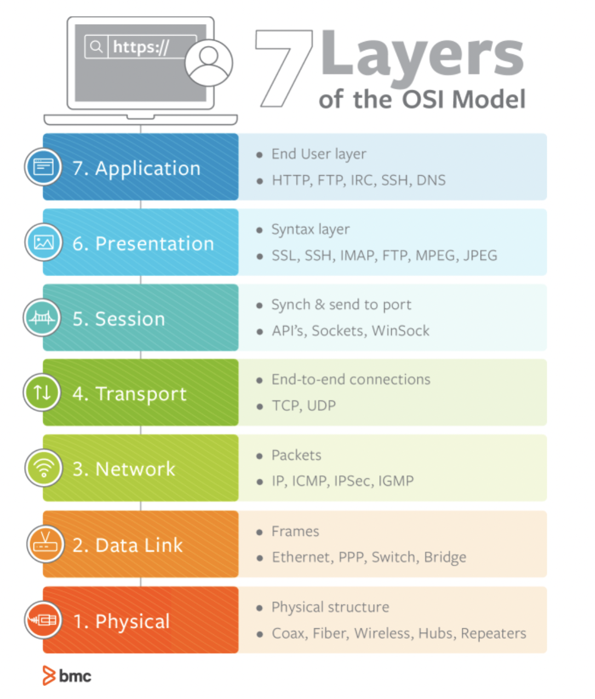

# TCP와 UDP의 차이를 작성해주세요.

## OSI 7 Layer



- OSI 모델은 1977년에 설계되었으며 1984년부터 ISO 규격의 일부이다.
- 각 OSI 계층은 네트워크 통신을 위한 고유한 작업을 수행한다.

<br>
</br>

## Transport Layer(4계층)

- 전송 계층으로 계층 4 또는 L4라고 부른다.
- 인터넷 프로토콜 및 OSI(Open Systems Interconnection)의 네트워크 스택에 있는 계층화된 프로토콜 아키텍처의 방법.
- 응용 프로그램에 대한 호스트 간 통신을 담당한다.

### 특징

- 연결 지향 데이터 스트림 지원(Connection-oriented communication)
- 동일 주문 배송(Same order delivery)
- 신뢰성(Reliability), 안정성
- 흐름 제어(Flow control)
- 혼잡 회피(Congestion avoidance)
- 포트 다중화(Port Multiplexing)

<br>
</br>

## TCP vs UDP

- **흐름 제어(Flow control)** 에 따라 분류

### TCP(Transmission Control Protocol)

- TCP/IP의 전송 프로토콜
- 연결 지향적(Connection-oriented)이며, 안정적이다.
- 신뢰성이 높다: 패킷 손실, 중복, 순서 바뀜이 없도록 보장한다.

  ex) 이메일, 좌석 예매(누군가 자리를 먼저 선점하면 알람으로 알려준다)

### UDP(User Datagram Protocol)

- 신뢰성이 낮아 완전성을 보증하지 않는다.
- 비연결성(connectionless): UDP를 사용하는 프로그램 측에서 오류 제어 기능을 갖춰야 한다.
- TCP보다 빠르고 간결한 구조로 설계할 수 있기 때문에, 빠른 요청과 응답이 필요한 실시간 통신(1:다)에 적합하다.

  ex) 실시간 스트리밍

  ```jsx
  편지를 보내기 위해 일단 편지 봉투에 보내는 사람과 받는 사람의 주소 정보를 쓴다
  우표를 붙여서 우체통에 넣어주면 끝

  // 편지를 보내고 나서 상대방의 수신 여부를 확인할 방법 없음 + 전송 도중에 편지 분실 가능성
  // 편지는 신뢰할 수 없는 전송 방법
  ```

<br>
</br>

### reference

- [OSI 7 Layer](https://osi-model.com/)
- [Transport layer](https://en.wikipedia.org/wiki/Transport_layer)
- [TCP vs UDP](https://www.geeksforgeeks.org/differences-between-tcp-and-udp/)
